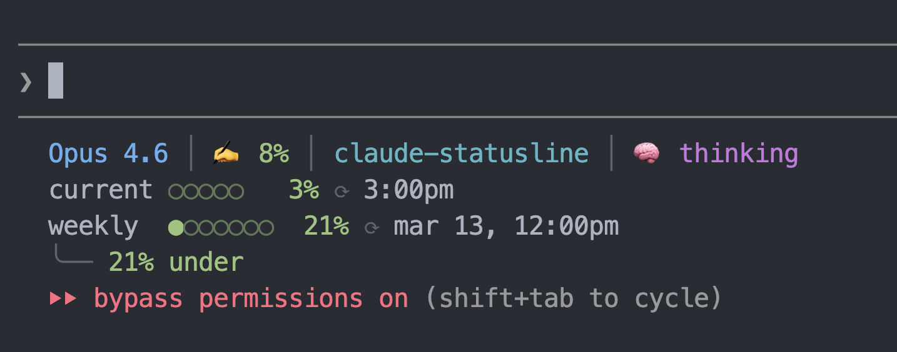

# claude-statusline

A statusline for [Claude Code](https://docs.anthropic.com/en/docs/claude-code) showing model info, context usage, rate limits with pace tracking, git branch, and session duration.

Atom One Dark color theme.



## Features

- Model name and context window usage (color-coded)
- Current directory and git branch with dirty indicator
- Thinking mode on/off
- 5-hour and weekly rate limit bars with reset times
- Weekly pace indicator (under/on/over expected usage)
- OAuth token auto-detection (macOS Keychain, credentials file, env var)

## Install

```bash
npx @carbonid1/claude-statusline
```

Backs up your existing statusline (if any), copies the script to `~/.claude/statusline.sh`, and configures Claude Code settings.

The installer will ask if you'd like to install the **statusline editor skill** — a [Claude Code skill](https://docs.anthropic.com/en/docs/claude-code/skills) that teaches Claude the architecture, color palette, and patterns so it can edit and extend your statusline for you. You can also pass `--skill` or `--no-skill` to skip the prompt:

```bash
npx @carbonid1/claude-statusline --skill      # install with skill
npx @carbonid1/claude-statusline --no-skill   # install without skill
```

## Requirements

- [jq](https://jqlang.github.io/jq/) — JSON parsing
- curl — rate limit API
- git — branch info

On macOS:

```bash
brew install jq
```

## Uninstall

```bash
npx @carbonid1/claude-statusline --uninstall
```

Restores your previous statusline from backup if available.

## Per-Project Statusline

Individual repos can extend the global statusline with project-specific indicators (server ports, env checks, build status, etc.) by adding a decorator script.

1. Create `.claude/statusline.sh` in your project:

```bash
#!/bin/bash
set -f
input=$(cat)

GLOBAL_SCRIPT="$HOME/.claude/statusline.sh"

if [ -x "$GLOBAL_SCRIPT" ]; then
    global_output=$("$GLOBAL_SCRIPT" <<< "$input")
else
    global_output="Claude"
fi

green='\033[38;2;152;195;121m'
magenta='\033[38;2;198;120;221m'
white='\033[38;2;171;178;191m'
dim='\033[2m'
reset='\033[0m'

# Check if your dev server is running
if lsof -i :3000 -sTCP:LISTEN >/dev/null 2>&1; then
    server="${green}●${reset} ${white}dev${reset}"
else
    server="${dim}○ dev${reset}"
fi

project=" ${magenta}┃${reset} ${server}"

first_line="${global_output%%$'\n'*}"
rest=""
if [[ "$global_output" == *$'\n'* ]]; then
    rest="${global_output#*$'\n'}"
fi

printf "%b%b" "$first_line" "$project"
[ -n "$rest" ] && printf "\n%b" "$rest"
exit 0
```

2. Make it executable and add a local settings override:

```bash
chmod +x .claude/statusline.sh
```

```json
// .claude/settings.local.json (gitignored — user-local)
{
  "statusLine": {
    "type": "command",
    "command": ".claude/statusline.sh"
  }
}
```

The decorator runs the global script, captures its output, appends your project indicators to line 1, and passes the remaining lines (rate limits, etc.) through unchanged.

The bundled skill teaches Claude how this system works — ask Claude to "add a port indicator to my statusline" and it will know the architecture, color palette, and patterns.

## Credits

Originally inspired by [@kamranahmedse/claude-statusline](https://github.com/kamranahmedse/claude-statusline).

## License

MIT
